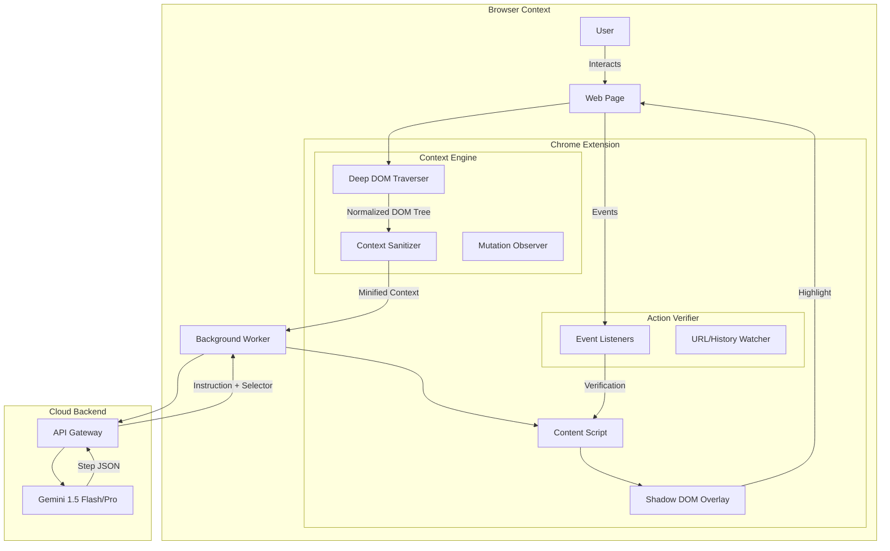

# Interactive Tutorial System - Advanced Architecture & Implementation Plan

## Executive Summary

This project aims to build a Chrome Extension that provides intelligent, context-aware interactive tutorials for any website. By leveraging the Gemini API, the system will dynamically generate step-by-step guidance, highlighting elements and verifying user actions in real-time.

**Verdict**: This is a high-value, technically feasible project with significant complexity "nuances" that distinguish a toy prototype from a production-grade tool.

---

## 1. Feasibility & Risk Analysis

### ✅ Highly Feasible
- **Core Extension Mechanics**: Injecting scripts, overlays, and API communication is standard Chrome Extension functionality.
- **LLM Integration**: Gemini is well-suited for interpreting DOM structures and generating natural language instructions.

### ⚠️ Complex Nuances (The "Real World" Challenges)
These are the specific technical hurdles that this plan addresses:

1.  **Shadow DOM Encapsulation**: Modern frameworks (Lit, Web Components) hide elements inside Shadow Roots, making standard `document.querySelector` fail.
2.  **Cross-Origin iFrames**: Embedded content (Stripe, YouTube, Chat widgets) cannot be accessed directly due to the Same-Origin Policy.
3.  **Dynamic Class Names**: CSS-in-JS (Styled Components, Emotion) and utility libraries (Tailwind) generate unstable class names (e.g., `.css-1r2f3`), making CSS selectors brittle.
4.  **Single Page Application (SPA) State**: URL changes don't always trigger page loads; the extension must detect "soft" navigations.
5.  **Context Window Limits**: Sending a raw 50,000-line HTML dump to an LLM is slow, expensive, and often exceeds token limits.

---

## 2. Technical Architecture

---

## 3. Core Challenges & Solutions (The Nuances)

### A. The "Shadow DOM" Problem
**Challenge**: `document.querySelector('#btn')` cannot find elements inside a Shadow Root.
**Solution**: **Recursive Shadow Piercing**.
- We implement a `deepQuerySelector` utility that walks the DOM tree, checking every element for a `.shadowRoot` property.
- If a shadow root is found, the traversal continues *inside* that root.
- **Nuance**: The overlay itself must be injected into a Shadow Root to prevent the host site's CSS from bleeding into our UI (and vice versa).

### B. The "Dynamic Class" Problem
**Challenge**: Selectors like `div.css-1532` break on the next build.
**Solution**: **Semantic & Structural Fingerprinting**.
- **Priority 1**: Stable Attributes (`id`, `data-testid`, `data-cy`, `name`, `aria-label`).
- **Priority 2**: Text Content ("Click the 'Submit' button").
- **Priority 3**: Structural Path (`body > main > div:nth-child(2) > button`).
- **LLM Strategy**: We instruct Gemini to prefer semantic locators. "Find the button with text 'Login'" is more robust than "Find `.btn-primary`".

### C. The "Context Window" Problem
**Challenge**: A full DOM dump is too large and noisy.
**Solution**: **Accessibility Tree Extraction**.
- Instead of sending raw HTML, we generate a simplified JSON tree representing the **Accessibility Tree**.
- We discard: `<script>`, `<style>`, `<meta>`, hidden elements (`display: none`), and generic `div` wrappers that add no semantic value.
- We keep: Interactive elements (`button`, `a`, `input`), headings, and text nodes.
- **Result**: 90% reduction in payload size, faster processing, and higher accuracy.

### D. The "iFrame" Problem
**Challenge**: We cannot read content inside cross-origin iFrames (e.g., a payment modal).
**Solution**: **Frame Injection & Message Passing**.
- The extension manifest must request `all_frames: true`.
- The content script injects into *every* frame.
- A central "Frame Coordinator" in the background script maps the frame hierarchy.
- When the LLM says "Click the Pay button", the message is routed to the specific frame containing that button.

---

## 4. Implementation Plan

### Phase 1: The Robust Foundation
1.  **Manifest V3 Setup**:
    - `host_permissions`: `<all_urls>`
    - `permissions`: `activeTab`, `scripting`, `storage`
2.  **Deep DOM Reader**:
    - Implement `getSimplifiedDom(root)` that recurses into Shadow DOMs.
    - Output: A JSON tree of interactive elements.
3.  **Shadow Overlay**:
    - Create a UI container attached to a closed Shadow Root.
    - Ensure `z-index: 2147483647` (max 32-bit integer).

### Phase 2: Intelligence Layer
1.  **Context Sanitizer**:
    - Filter out sensitive data (replace `value="password123"` with `value="[REDACTED]"`).
    - Prune non-semantic nodes.
2.  **Gemini Integration**:
    - Prompt Engineering: "You are a UI automation expert. Given this DOM tree, identify the element for user goal: '{goal}'. Return a stable selector."
    - Output Schema: `{ selector: string, explanation: string, actionType: 'click' | 'input' }`.

### Phase 3: The Interaction Loop
1.  **Element Highlighter**:
    - `getBoundingClientRect()` handles scroll offsets.
    - **Nuance**: Handle `position: fixed` and `sticky` elements correctly.
2.  **Action Verification**:
    - **Click**: Global capture-phase listener.
    - **Input**: `input` and `change` events.
    - **Navigation**: `popstate` and `hashchange` listeners for SPAs.

### Phase 4: Polish & Resilience
1.  **Retry Logic**: If an element isn't found immediately (e.g., loading spinner), poll for 5 seconds using `MutationObserver`.
2.  **Scroll-Into-View**: Automatically scroll the target element into the viewport with padding.
3.  **Error Recovery**: If the user clicks the wrong thing, detect the deviation and offer to "Get back on track".

---

## 5. Data Privacy Strategy
- **Local Sanitization**: No raw HTML leaves the browser without stripping `input` values.
- **Allowlist/Blocklist**: Users can disable the extension on specific domains (e.g., banking).
- **Ephemeral Context**: The backend does not store DOM dumps; they are processed and discarded.

## 6. Success Metrics
- **Selector Stability**: >90% of generated steps remain valid after a page reload.
- **Latency**: Step generation < 2 seconds.
- **Coverage**: Works on Shadow DOM sites (e.g., YouTube) and iFrame-heavy sites.