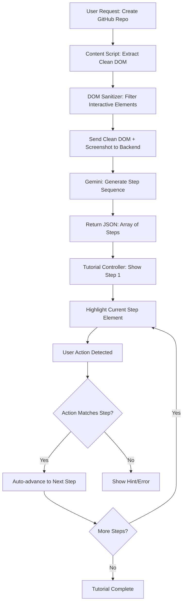

# DOM Sanitization and Step-by-Step Tutorial System

## Overview

Enhance the Chrome extension to extract a clean, semantic DOM tree (filtering out noise) and implement a step-by-step tutorial flow where users can follow along one step at a time when creating a GitHub repository.

## Architecture Flow



## Implementation Plan

### Phase 1: DOM Sanitization Utility

**File: `site-tutor-extension/src/utils/domSanitizer.ts`** (new file)

Create a utility that extracts a clean, semantic DOM tree:

- **Filter out**: `<script>`, `<style>`, `<meta>`, hidden elements (`display: none`, `visibility: hidden`), generic wrapper divs with no semantic value
- **Keep**: Interactive elements (`button`, `a`, `input`, `select`, `textarea`), headings (`h1-h6`), form elements, elements with `role` attributes, elements with stable identifiers (`id`, `data-testid`, `aria-label`)
- **Output**: Simplified JSON tree representing the accessibility tree
- **Shadow DOM support**: Recursively traverse shadow roots (as per central plan)
- **Sensitive data**: Redact input values (replace with `[REDACTED]`)

Key functions:

- `getSimplifiedDom(root: Document | ShadowRoot): SimplifiedNode[]`
- `isInteractiveElement(el: Element): boolean`
- `isSemanticElement(el: Element): boolean`
- `traverseShadowDOM(root: Document | ShadowRoot): Element[]`

### Phase 2: Step-by-Step Tutorial Component

**File: `site-tutor-extension/src/components/TutorialController.tsx`** (new file)

Create a tutorial controller that:

- Manages current step index
- Shows one highlight at a time
- Displays step instructions
- Provides Next/Previous navigation buttons
- Shows progress indicator (e.g., "Step 2 of 5")
- Auto-advances when user completes an action (optional)

**File: `site-tutor-extension/src/components/Overlay.tsx`** (modify)

Update to support single-step highlighting:

- Accept `currentStepIndex` prop
- Only highlight the element for the current step
- Add smooth transitions between steps

### Phase 3: Action Verification System

**File: `site-tutor-extension/src/utils/actionVerifier.ts`** (new file)

Implement action detection to verify user completes steps:

- **Click verification**: Listen for clicks on the target element
- **Input verification**: Detect when user fills required fields
- **Navigation verification**: Detect URL changes or SPA route changes
- **Timeout handling**: If user doesn't complete step in reasonable time, show hint

### Phase 4: Backend Enhancement for Tutorial Generation

**File: `backend/main.py`** (modify)

Enhance the `/chat` endpoint to:

- Accept clean DOM tree in addition to screenshot
- Detect tutorial requests (e.g., "create a new repo", "how to create a repository")
- Generate a sequence of steps as JSON array
- Each step includes: `selector`, `instruction`, `actionType` (`click`, `input`, `wait`, `navigate`), `expectedResult`

New response format:

```json
{
  "text": "I'll guide you through creating a new GitHub repository step by step.",
  "tutorial": {
    "title": "Create a New GitHub Repository",
    "steps": [
      {
        "stepNumber": 1,
        "selector": "button[data-testid='new-repo-button']",
        "instruction": "Click the 'New' button in the top right",
        "actionType": "click",
        "expectedResult": "Repository creation form appears"
      },
      // ... more steps
    ]
  }
}
```

### Phase 5: Integration Updates

**File: `site-tutor-extension/src/components/Chatbot.tsx`** (modify)

- Detect when response contains `tutorial` object
- Switch to tutorial mode instead of simple highlighting
- Pass tutorial steps to `TutorialController`
- Handle tutorial completion

**File: `site-tutor-extension/src/content/index.tsx`** (modify)

- Export DOM sanitizer utility
- Send clean DOM to backend when making requests

## Key Features

1. **Clean DOM Extraction**: 90% reduction in payload size by filtering non-semantic elements
2. **Step-by-Step Flow**: One highlight at a time with clear instructions
3. **Action Verification**: Auto-detect when user completes a step
4. **Navigation Controls**: Next/Previous buttons for manual control
5. **Progress Tracking**: Visual indicator of tutorial progress
6. **Error Recovery**: If user clicks wrong element, provide guidance

## Technical Considerations

- **Shadow DOM**: Recursive traversal to find elements inside shadow roots
- **Dynamic Content**: MutationObserver to handle elements that appear after initial load
- **Selector Stability**: Prefer semantic selectors (IDs, data attributes) over class names
- **Performance**: Debounce DOM extraction to avoid excessive processing
- **Privacy**: Redact sensitive input values before sending to backend

## Files to Create/Modify

**New Files:**

- `site-tutor-extension/src/utils/domSanitizer.ts` - DOM filtering and extraction
- `site-tutor-extension/src/components/TutorialController.tsx` - Step-by-step tutorial UI
- `site-tutor-extension/src/utils/actionVerifier.ts` - Action detection and verification

**Modified Files:**

- `site-tutor-extension/src/components/Chatbot.tsx` - Add tutorial mode detection
- `site-tutor-extension/src/components/Overlay.tsx` - Support single-step highlighting
- `backend/main.py` - Add tutorial generation logic
- `site-tutor-extension/src/content/index.tsx` - Integrate DOM sanitizer

## Success Criteria

- Clean DOM extraction reduces payload by >80%
- Tutorial steps are generated correctly for GitHub repo creation
- Users can navigate steps forward/backward
- System detects when user completes each step
- Works on GitHub's dynamic SPA interface